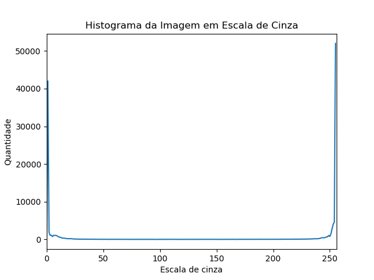

# Dijkstra Visualizado

**Número da Lista**: Lista 3<br>
**Conteúdo da Disciplina**: Algoritmos Gulosos - Codificação de Huffman<br>

## Alunos

|Matrícula | Aluno |
| -- | -- |
| 17/0039251  |  Lieverton Santos Silva |
| 17/0024121  |  Welison Lucas Almeida Regis |

## Sobre

O projeto foca na utilização da **Codificação de Huffman** voltada para imagens. Tem-se como entrada do software uma imagem (colorida ou em escala de cinza) em formatos comuns (.png, .jpg, .bmp...). A partir da imagem, é processada a foto em escala de cinza, computado o seu histograma, isto é, a frequência de cada pixel no intervalo [0, 256). Com o histograma, gera-se a **árvore e os códigos de huffman** que auxiliam na compressão e na descompactação da imagem.

Resultados obitidos podem ser visualizados em `/results`.

## Screenshots

*   Exemplo de Imagem Utilizada na Codificação

| Imagem Real  | Imagem em Escala de Cinza |
|:-:|:-:|
|  |  |

*   Histograma da imagem em escala de cinza



*   Código de Huffman gerado:

```json
{
    "0": "111011101",
    "1": "10",
    "2": "1111101",
    "3": "1100111",
    "4": "1101101",
    "5": "11101111",
    [...],
    "249": "1100100",
    "250": "11110010",
    "251": "1110110",
    "252": "111010",
    "253": "11000",
    "254": "11010",
    "255": "0"
}
```

*   Resultados do processamento:
    *   Tamanho em bits da imagem original: 1098000 bits
    *   Tamanho em bits da imagem comprimida: 486409 bits
    *   Quantidade de bits comprimidos: 611591 bits
    *   Taxa de compressão: 0.557005 (~ 56%)

*   Os binários gerados (comprimido e não comprimido) podem ser visualizados na pasta `results`.

## Instalação

**Linguagem**: Python 3.7<br>
**Bibliotecas**:
*   Instale os pré-requisitos do projeto: `pip install -r requirements.txt`.

*   Versão do pip utilizada: 19.0.3.
*   Caso seja necessário, instale manualmente os requirements (opencv-python e matplotlib)

## Uso

*   Execute a aplicação da seguinte forma:
    *   Acesse a raiz do projeto: `cd Greed_HuffmanCompression`.
    *   Com o python 3, execute: `python3 src/main.py`.
    *   Quando solicitado o caminho da imagem, digite o local com a respectiva extensão. Ex.: `assets/face.png`.
    *   Resultados seram armazenados em `/results`.

*   Imagens de exemplos disponíveis em `assets`.
